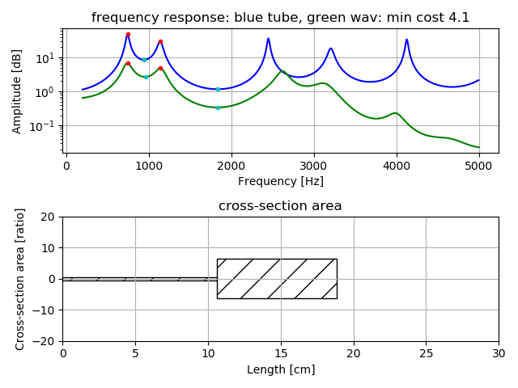
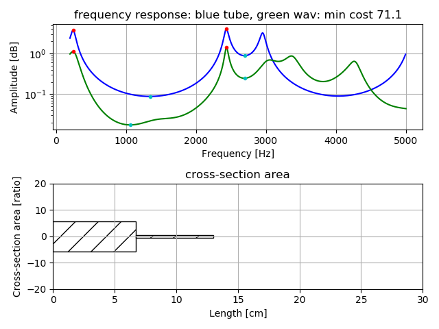
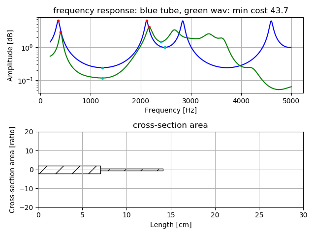

# Vocal Tube Estimation   

A trial estimation of vocal tract as very simple tube model, two tubes model or three tubes model, 
using several peak and drop-peak frequencies of vowel voice, by precomputed grid search and downhill simplex method.  

[github repository](https://github.com/shun60s/Vocal-Tube-Estimation/)  

## usage   

example of vowel /a/.  Result will save as figures in the result_figure directory. Input wav format should be mono,16bit,16Khz.  
```
python3 pks2tube1.py -w wav/a_1-16k.wav -r result_figure   
```
  


example of vowel /i/  
```
python3 pks2tube1.py -w wav/i_1-16k.wav -r result_figure   
```
  


example of vowel /u/  
```
python3 pks2tube1.py -w wav/u_1-16k.wav -r result_figure   
```
  


example of vowel /e/  
```
python3 pks2tube1.py -w wav/e_1-16k.wav -r result_figure   
```
  


example of vowel /o/.  Specify -t 3, due to vowel /o/ uses three tubes model  
```
python3 pks2tube1.py -w wav/o_1-16k.wav -r result_figure -t 3   
```
  


make precomputed data for grid search to estimate two tubes model  
```
python3 pre_compute1.py   
```
It will save pks_dpks_stack_tube2.npz.  


make precomputed data for grid search to estimate three tubes model   
```
python3 pre_compute1.py -t 3   
```
It will save pks_dpks_stack_tube3.npz.  


re-sampling wav to 16Khz sampling  
```
python3 resample1.py -w wav-file-name(mono,16bit)  
```

## Document  

For more information, please see [related WEB](https://wsignal.sakura.ne.jp/onsei2007/vocal-tube-estimation-e.html) or 
[same content in Japanese](https://wsignal.sakura.ne.jp/onsei2007/vocal-tube-estimation.html)  


## License    
MIT  
except LPC.py  

